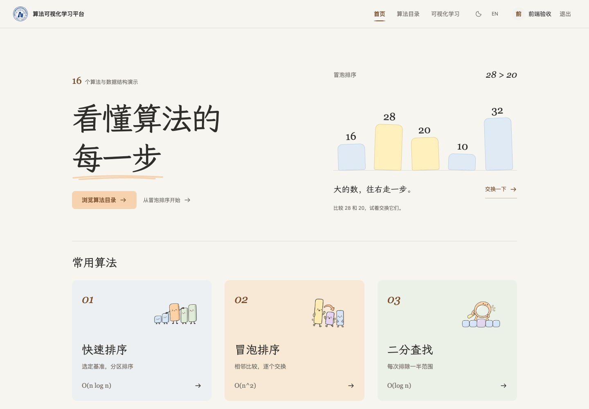
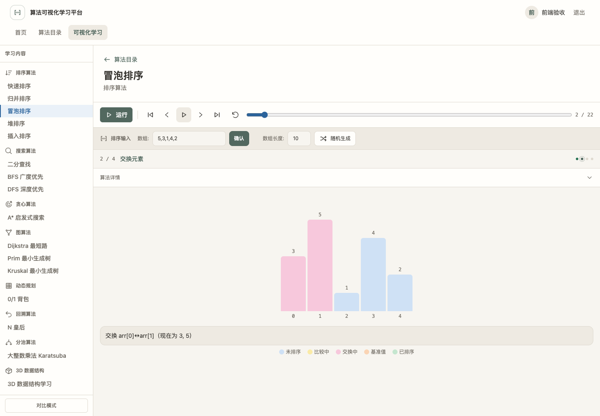
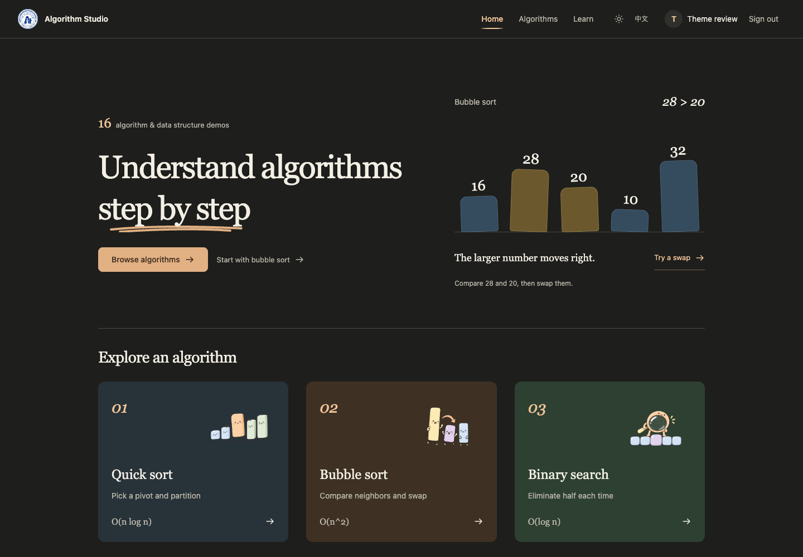

<div align="center">

# 算法可视化学习平台

**看懂算法的每一步**

16 个算法与数据结构演示 · 分步播放 · 双算法对比 · 3D 交互

[快速开始](#快速开始) · [本地开发](#本地开发) · [项目文档](#项目文档)



</div>

## 用它做什么

| 能力 | 体验 |
| --- | --- |
| 逐步理解 | 输入数据，运行、暂停、单步或拖动进度，观察图形与步骤说明 |
| 对照学习 | 对兼容算法使用同一份输入，并排查看执行过程与统计 |
| 探索结构 | 在 3D 场景中操作数组、栈、队列、链表、二叉树与 B+ 树 |
| 舒适阅读 | 顶部分类导航、默认折叠详情、中英文切换、明暗主题与减少动态效果支持 |

**算法覆盖**：快速、归并、冒泡、堆与插入排序；二分查找；BFS、DFS、Dijkstra、Prim、Kruskal、A*；0/1 背包、N 皇后与 Karatsuba 大整数乘法。

<details>
<summary>更多界面：学习页与深色主题</summary>





</details>

## 快速开始

安装并启动 **Docker Desktop**，或使用 Docker Engine + Compose v2。以下命令在仓库根目录执行，镜像构建会自动安装依赖并编译前后端。

```bash
git clone https://github.com/sleepy-shawn/Algorithm_Visualization.git
cd Algorithm_Visualization
docker compose -fdeploy/docker-compose.yml up -d --build
```

打开 **[localhost:8082](http://localhost:8082)**，注册账号后即可使用。基础算法演示无需配置 AI Key。

| 服务 | 本地地址 |
| --- | --- |
| 网页 | `http://localhost:8082` |
| 后端健康检查 | `http://localhost:8081/api/algorithms/health` |
| MySQL | `localhost:3316` |

```bash
# 查看运行状态与日志
docker compose -fdeploy/docker-compose.yml ps
docker compose -fdeploy/docker-compose.yml logs -f backend

# 停止服务，保留数据库数据
docker compose -fdeploy/docker-compose.yml stop
```

## 本地开发

需要 **Node.js 20** 和 npm。先启动数据库与后端，再运行支持热更新的前端：

```bash
# 仓库根目录
docker compose -fdeploy/docker-compose.yml up -d --build mysql backend
cd frontend
npm ci
npm start
```

打开 **[localhost:4200](http://localhost:4200)**。开发代理已将 `/api` 和 `/ws` 转发到后端 `8081` 端口。

### 构建与测试

```bash
# 仓库根目录：前端构建、单元测试、浏览器测试
npm --prefix frontend run build
npm --prefix frontend test -- --watch=false --browsers=ChromeHeadless
npm --prefix frontend run test:e2e

# 后端测试与打包：需要 Java 17 和 Maven
mvn -f backend/pom.xml package
```

前端测试使用本机 Chrome；浏览器测试还需数据库与后端运行，会创建测试账号和运行记录。

## 项目结构

```text
frontend/   Angular 17 · TypeScript · Tailwind CSS · Three.js
backend/    Spring Boot 3.2 · Java 17 · Spring Data JPA
deploy/    Docker Compose · MySQL 8
docs/    设计说明、交付记录与界面截图
```

当前网页聚焦首页、目录与学习页。AI 助手、竞赛、评估和历史记录的后端代码仍保留，但没有对应的前端入口。账号系统提供注册与登录，尚未建立服务端会话鉴权；当前配置面向本地教学演示。

## 项目文档

- [小组 UML 图册](docs/uml/README.md)：基于最新主分支的类图、时序图，以及 PNG / SVG / Mermaid 源码。

- [前端交付与验证](docs/issue-5-delivery.md)：界面规范、主题、语言、交互和截图。
- [学习引导设计](docs/learning-guidance-system.md)：教学阶段与对比思路，含历史功能设计。
- [版本差异](docs/base-differences.md) · [外部项目对比](docs/algorithm-visualizer-comparison.md)：项目范围与实现说明。
- [插画素材与生成提示词](frontend/src/assets/illustrations/GARDEN-PROMPTS.md) · [字体来源与许可](frontend/src/assets/fonts/README.md)。
- [算法执行轨迹与对比 API](docs/algorithm-trace-api.md)：后端保留接口的统一步骤协议与错误格式（前端暂未接入）。

---

第七小组 · 仅供学习和教学使用。
