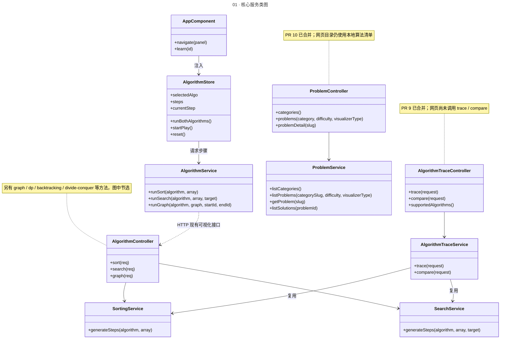
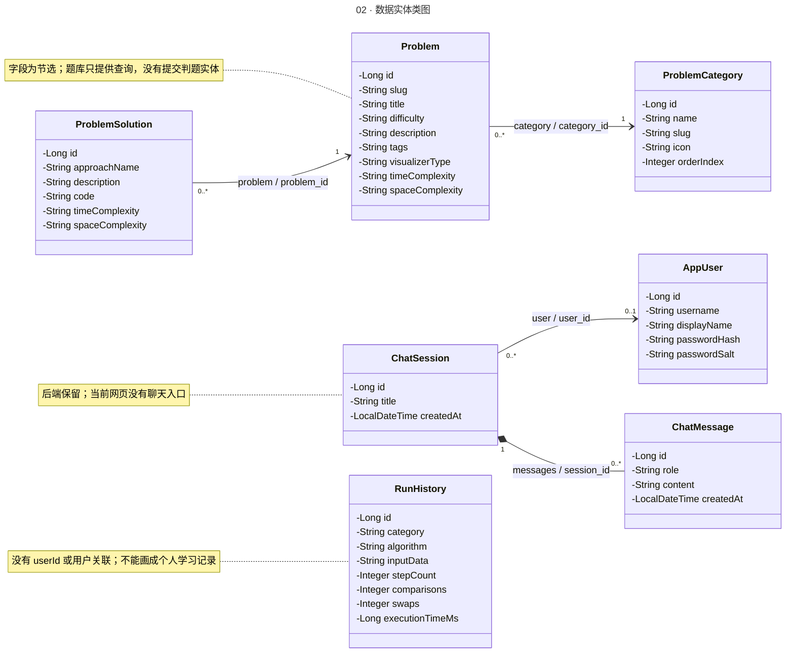
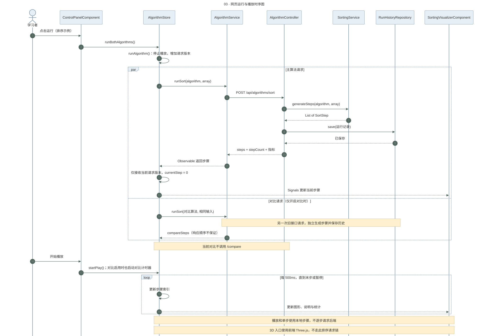
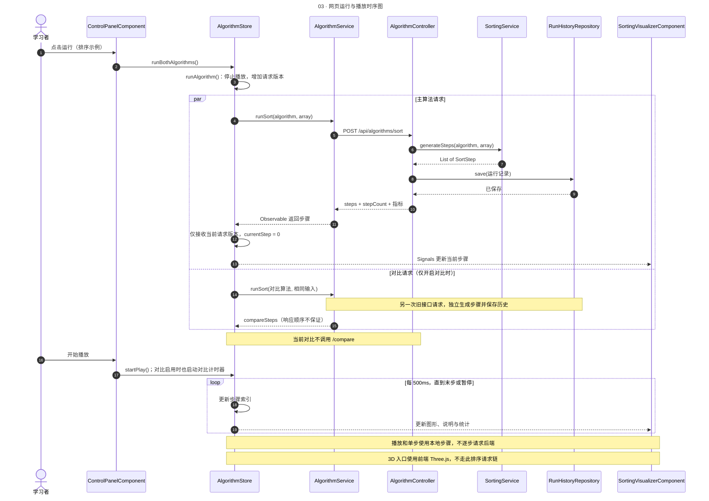
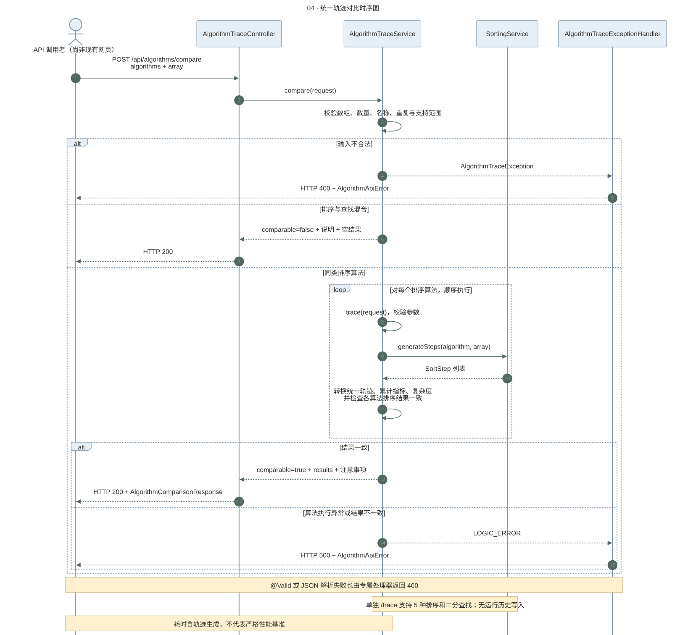
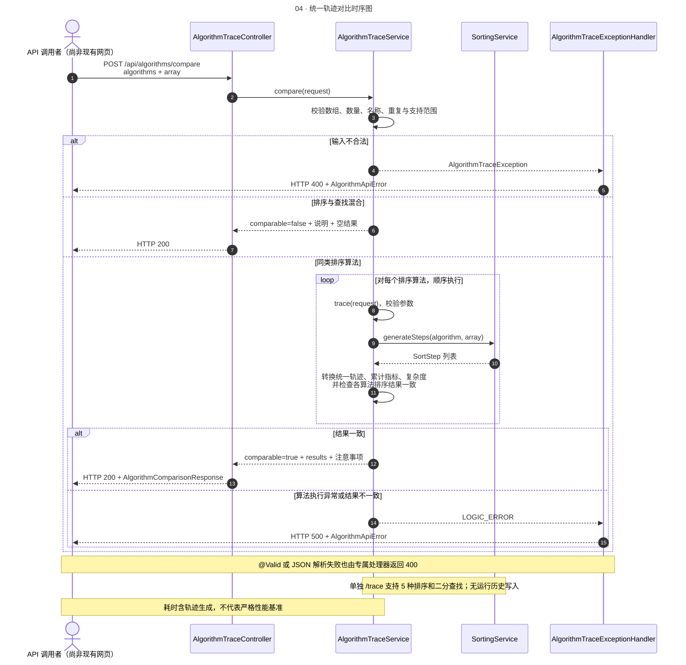
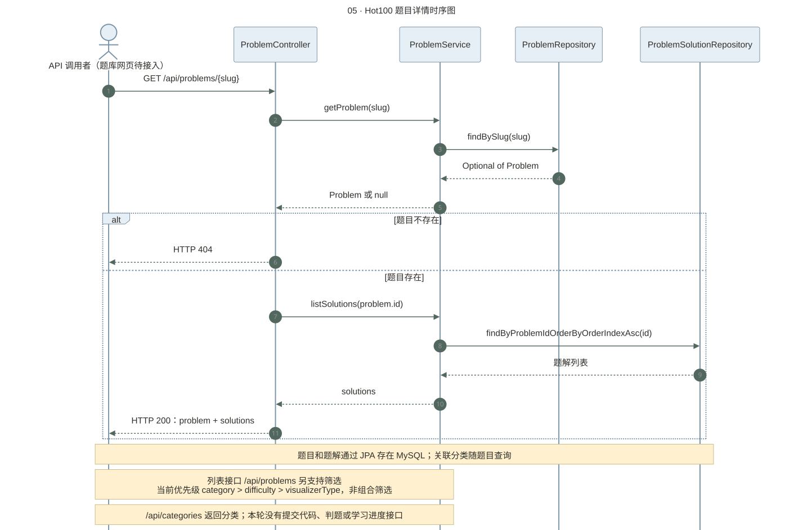
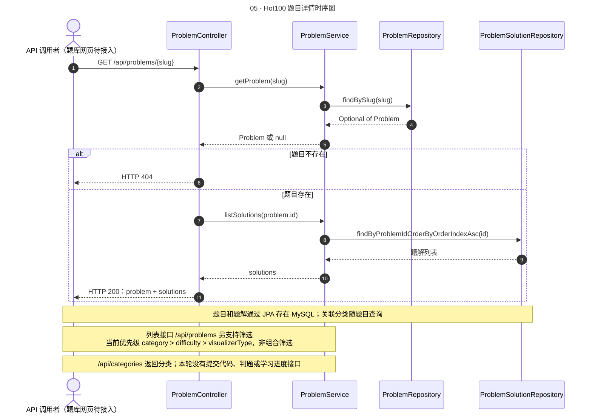

# 算法可视化平台 · UML 图册

**第七小组 · 第二次实践活动**  
依据 GitHub `main`，核对日期：2026-09-09。固定基准：[ `256ff09` ](https://github.com/sleepy-shawn/Algorithm_Visualization/commit/256ff09dbc15e37a4c520797ab265d8e321a3ad2)。

本图册使用 Mermaid 绘制 **2 张 UML 类图 + 3 张 UML 时序图**。类名和方法名对应实现；中文用于解释职责。可直接将 PNG 插入报告，SVG 适合无损缩放，`.mmd` 可粘贴到支持 Mermaid 的编辑器中继续修改。

## 最新进展

| 已合并 PR | 当前实现 | 图中对应 |
| --- | --- | --- |
| [#8 前端体验](https://github.com/sleepy-shawn/Algorithm_Visualization/pull/8) | 首页、目录、学习页；主题、语言、播放与兼容算法对比 | 图 1、3 |
| [#9 执行轨迹](https://github.com/sleepy-shawn/Algorithm_Visualization/pull/9) | 统一 trace / compare、错误解释与复杂度指标 | 图 1、4 |
| [#10 Hot100 题库](https://github.com/sleepy-shawn/Algorithm_Visualization/pull/10) | 分类、题目、题解实体；种子数据与只读 API | 图 1、2、5 |
| [#6 部署与契约](https://github.com/sleepy-shawn/Algorithm_Visualization/pull/6) | Docker 服务重启策略与接口说明 | 运行环境：浏览器 → Nginx → Spring Boot → MySQL |

**范围说明**：当前目录数据仍来自前端 `ALGORITHM_GROUPS`；网页尚未调用新题库、`/trace` 或 `/compare`。聊天、竞赛和 AI 后端保留，但没有对应网页入口。登录返回用户信息，尚无服务端会话令牌；类图中的用户关联不代表已经实现访问控制。

## 图纸索引

| 图 | PNG（报告） | SVG（矢量） | Mermaid（编辑） |
| --- | --- | --- | --- |
| 核心服务类图 | [PNG](images/01-services.png) | [SVG](images/01-services.svg) | [源码](source/01-services.mmd) |
| 数据实体类图 | [PNG](images/02-domain.png) | [SVG](images/02-domain.svg) | [源码](source/02-domain.mmd) |
| 网页运行与播放时序图 | [PNG](images/03-playback.png) | [SVG](images/03-playback.svg) | [源码](source/03-playback.mmd) |
| 统一轨迹对比时序图 | [PNG](images/04-trace-compare.png) | [SVG](images/04-trace-compare.svg) | [源码](source/04-trace-compare.mmd) |
| Hot100 题目详情时序图 | [PNG](images/05-problems.png) | [SVG](images/05-problems.svg) | [源码](source/05-problems.mmd) |

## 1. 核心服务类图

选取网页状态、现有算法接口与两个新模块的关键类；是实现节选，不是全项目类清单。实线箭头表示持有或注入的引用，虚线箭头表示 HTTP 调用依赖。



<details>
<summary>展开可编辑 Mermaid 源码</summary>



</details>

## 2. 数据实体类图

标出数据库实体与关联基数。ChatSession 的 user_id 允许为空，因此为 0..1；ChatMessage 由会话级联删除，使用组合关系。RunHistory 没有用户关联。属性为理解模型所需的节选，减号表示 private。



<details>
<summary>展开可编辑 Mermaid 源码</summary>



</details>

## 3. 网页运行与播放时序图

以排序为例描述当前网页的真实调用链。结果包含全部步骤，之后的播放和单步在浏览器内进行；双算法对比分别请求旧接口。失败反馈及完整并发取消细节未展开。



<details>
<summary>展开可编辑 Mermaid 源码</summary>



</details>

## 4. 统一轨迹对比时序图

描述 PR #9 的新接口。调用者标为 API 调用者，避免误画成网页已接入。正常分支使用同类排序；跨类别对比返回 comparable=false，业务逻辑错误由专属异常处理器转换。



<details>
<summary>展开可编辑 Mermaid 源码</summary>



</details>

## 5. Hot100 题目详情时序图

描述 PR #10 的题库查询接口。不存在的 slug 返回 404；存在时查询题解并返回 problem + solutions。没有添加尚未实现的判题、提交或学习进度功能。



<details>
<summary>展开可编辑 Mermaid 源码</summary>



</details>

## 代码依据

以下链接固定到绘图基准，便于老师或组员核对，后续仓库改动不会改变本次依据。

- [app.component.ts](https://github.com/sleepy-shawn/Algorithm_Visualization/blob/256ff09dbc15e37a4c520797ab265d8e321a3ad2/frontend/src/app/app.component.ts)
- [algorithm.store.ts](https://github.com/sleepy-shawn/Algorithm_Visualization/blob/256ff09dbc15e37a4c520797ab265d8e321a3ad2/frontend/src/app/store/algorithm.store.ts)
- [algorithm.service.ts](https://github.com/sleepy-shawn/Algorithm_Visualization/blob/256ff09dbc15e37a4c520797ab265d8e321a3ad2/frontend/src/app/services/algorithm.service.ts)
- [algorithm-catalog.ts](https://github.com/sleepy-shawn/Algorithm_Visualization/blob/256ff09dbc15e37a4c520797ab265d8e321a3ad2/frontend/src/app/data/algorithm-catalog.ts)
- [AlgorithmController.java](https://github.com/sleepy-shawn/Algorithm_Visualization/blob/256ff09dbc15e37a4c520797ab265d8e321a3ad2/backend/src/main/java/com/algorithmviz/controller/AlgorithmController.java)
- [AlgorithmTraceService.java](https://github.com/sleepy-shawn/Algorithm_Visualization/blob/256ff09dbc15e37a4c520797ab265d8e321a3ad2/backend/src/main/java/com/algorithmviz/service/AlgorithmTraceService.java)
- [AlgorithmTraceExceptionHandler.java](https://github.com/sleepy-shawn/Algorithm_Visualization/blob/256ff09dbc15e37a4c520797ab265d8e321a3ad2/backend/src/main/java/com/algorithmviz/controller/AlgorithmTraceExceptionHandler.java)
- [ProblemController.java](https://github.com/sleepy-shawn/Algorithm_Visualization/blob/256ff09dbc15e37a4c520797ab265d8e321a3ad2/backend/src/main/java/com/algorithmviz/controller/ProblemController.java)
- [ProblemService.java](https://github.com/sleepy-shawn/Algorithm_Visualization/blob/256ff09dbc15e37a4c520797ab265d8e321a3ad2/backend/src/main/java/com/algorithmviz/service/ProblemService.java)
- [entity](https://github.com/sleepy-shawn/Algorithm_Visualization/tree/256ff09dbc15e37a4c520797ab265d8e321a3ad2/backend/src/main/java/com/algorithmviz/entity)

## 编辑与导出

GitHub 可直接显示本文中的 Mermaid 源码块。复制 `source/*.mmd` 到支持 Mermaid 的编辑器即可调整图形；本图册并非 StarUML 原生工程。

使用 Mermaid CLI 导出（不需要修改应用依赖）：

```bash
npx --yes --package @mermaid-js/mermaid-cli mmdc \
  -i docs/uml/source/01-services.mmd \
  -o docs/uml/images/01-services.svg \
  -c docs/uml/mermaid-config.json -b '#FFFEFB' -w 1600
```

将输出扩展名改为 `.png` 即可导出位图。CLI 需要可用的 Chromium；已有浏览器时可通过 `-p` 指定 Puppeteer 配置。本次全部图纸通过 CLI 语法解析并导出，再检查文字、连线与裁切。仅新增文档，不修改或重启应用。
